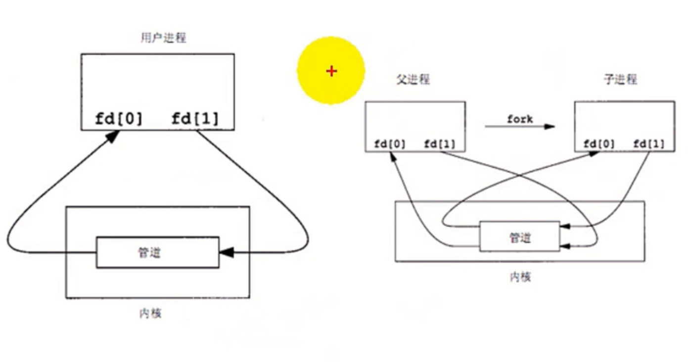

# 管道（一）

# 管道
- 管道是Unix中最古老的进程间通信的形式。
- 我们把从一个进程连接到另一个进程的一个数据流称为一个“管道”
- 管道是半双工的，数据只能向一个方向流动;需要双方通信时，需要建立起两个管道
- 只能用于具有共同祖先的进程(具有亲缘关系的进程)之间进行通信;通常，一个管道由一个进程创建，然后该进程调用fork，此后父、子进程之间就可应用该管道。

# 匿名管道pipe
- 包含头文件<unistd.h>
- 功能:创建一无名管道
- 原型
  - int pipe(int fd[2]);
- 参数
  - fd:文件描述符数组，其中fd[0]表示读端, fd[1]表示写端
- 返回值:成功返回0，失败返回错误代码

管道的示意图

# 管道示例程序
- [使用pipe函数](01pipe.c)
- [模拟 ls | wc -w](02pipe.c)

# 管道（二）

## 管道的读写规则
- 当没有数据可读时
  - 0_N0NBL0CK disable: read调用阻塞，即进程暂停执行，一直等到有数据来到为止。
  - 0_ NONBLOCK enable: read调用返回-1，errno值为EAGAIN。
- 如果所有管道写端对应的文件描述符被关闭，则read返回0
- 如果所有管道读端对应的文件描述符被关闭，则write操作会产生信号SIGPIPE
- 当要写入的数据量不大于PIPE_BUF时， linux将保证写入的原子性
- 当要写入的数据量大于PIPE_BUF时，linux将不再保证写入的原子性

## 验证管道的大小
- 思路：创建一个pipe，不断的其中写数据，如果管道满了，write默认会阻塞。
- 代码：[04pipe_size.c](04pipe_size.c)