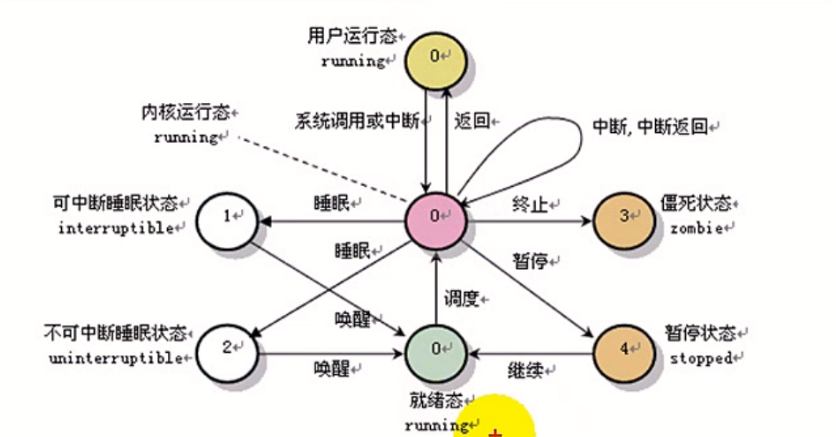
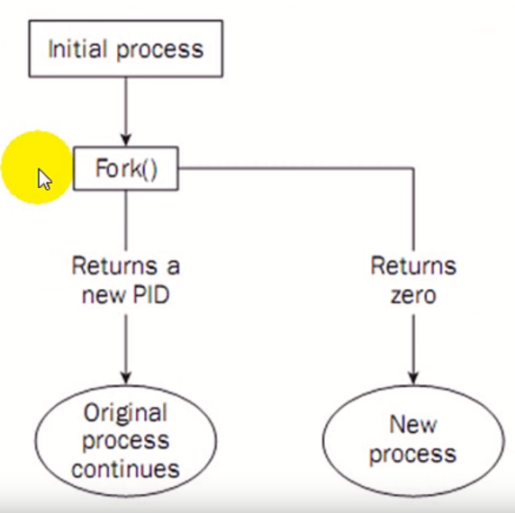
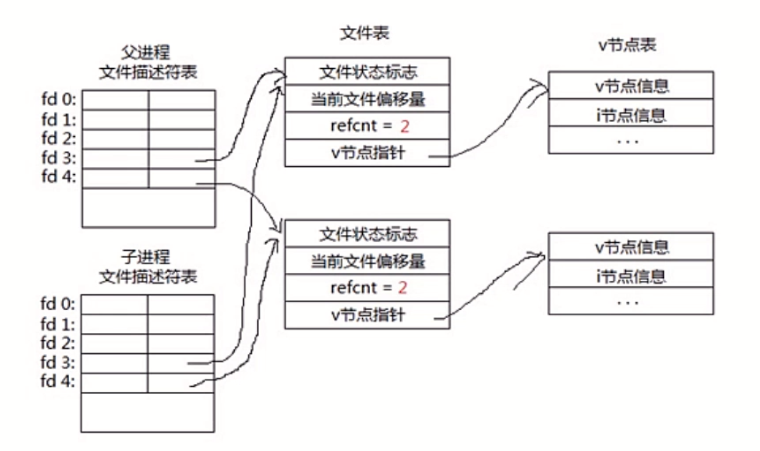
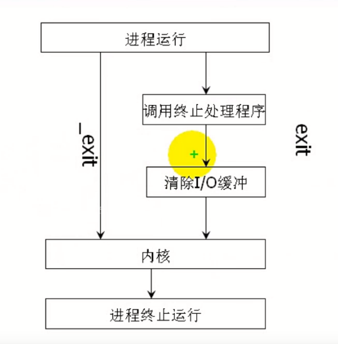

# 进程（一）

## 什么是程序
- 程序是完成特定任务的一系列指令集合。

## 什么是进程
- 从用户的角度来看进程是程序的一次执行过程
- 从操作系统的核心来看，进程是操作系统分配的内存、CPU时间片等资源的基本单位。
- 进程是资源分配的最小单位
- 每一个进程都有自己独立的地址空间与执行状态
- 像UNIX这样的多任务操作系统能够让许多程序同时运行，每一个运行着的程序就构成了一个进程

## 进程数据结构
```
*-------*
| 代码段 |
*-------*
| 数据段 |
*-------*
| 堆栈段 |
*-------*
| P C B |
*-------*
```
- 我们进程的静态描述:由三部分组成:PCB、有关程序段和该程序段对其进行操作的数据结构集。
- 进程控制块:用于描述进程情况及控制进程运行所需的全部信息。
- 代码段:是进程中能被进程调度程序在CPU上执行的程序代码段。
- 数据段:一个进程的数据段，可以是进程对应的程序加工处理的原始数据，也可以是程序执行后产生的中间或最终数据

## 进程与程序的区别与联系
- 进程是动态的，程序是静态的
- 进程的生命周期是相对短暂的，而程序是长久的
- 进程数据结构PCB
- 一个进程只能对应一个程序，一个程序可以对应多个进程。

# 进程（二）

## 进程状态变迁
- 基本的三种状态就绪、等待、运行
- Linux当中的进程状态
  - 运行状态（TASK_RUNNING)
  - 可中断睡眠状态（TASK_INTERRUPTIBLE)
  - 不可中断睡眠状态（TASK_UNINTERRUPTIBLE)
  - 暂停状态（TASK_STOPPED)
  - 僵死状态（TASK_ZOMBIE)



## 进程控制块

- 进程描述信息
  - 进程标识符用于唯一的标识一个进程。
- 进程控制信息
  - 进程当前状态
  - 进程优先级
  - 程序开始地址
  - 各种计时信息
  - 通信信息
- 资源信息
  - 占用内存大小及管理用数据结构指针
  - 交换区相关信息
  - IO设备号、缓冲、设备相关的数结构
  - 文件系统相关指针
- 现场保护信息
  - 寄存器
  - PC
  - 程序状态字PSW
  - 栈指针

## 进程标识
  
- 每个进程都会分配到一个独一无二的数字编号，我们称之为“进程标识”(process identifier),或者就直接叫它PID.
- 是一个正整数，取值范围从2到32768
- 当一个进程被启动时，它会顺序挑选下一个未使用的编号数字做为自己的PID
- 数字1一般为特殊进程init保留的，数字0为内核进程保留

## 进程创建

不同的操作系统所提供的进程创建原语的名称和格式不尽相同，但执行创建进程原语后，操作系统所做的工作却大致相同，都包括以下几点:
- 给新创建的进程分配一个内部标识，在内核中建立进程结构
- 复制父进程的环境
- 为进程分配资源，包括进程映像所需要的所有元素（程序、数据、用户栈等）
- 复制父进程地址空间的内容到该进程地址空间中。
- 置该进程的状态为就绪，插入就绪队列。

## 进程撤消
进程终止时操作系统做以下工作:
- **关闭软中断**:因为进程即将终止而不再处理任何软中断信号
- **回收资源**:释放进程分配的所有资源，如关闭所有已打开文件，释放进程相应的数据结构等;
- **写记帐信息**:将进程在运行过程中所产生的记帐数据（其中包括进程运行时的各种统计信息）记录到一个全局记帐文件中;
- **置该进程为僵死状态**:向父进程发送子进程死的软中断信号，将终止信息status送到指定的存储单元中;
- **转进程调度**:因为此时CPU已经被释放，需要由进程调度进行CPU再分配。

## 终止进程的五种方法
- 从main函数返回
- 调用exit（libc）
- 调用_exit（系统调用）
- 调用abort由信号SIGABRT终止

# 进程（三）

## 复制进程映像
- 使用fork函数得到的子进程从父进程的继承了整个进程的地址空间，包括:进程上下文、进程堆栈、内存信息、打开的文件描述符、信号控制设置、进程优先级、进程组号、当前工作目录、根目录、资源限制、控制终端等。
- 子进程与父进程的区别在于:
  1. 父进程设置的锁，子进程不继承
  2. 各自的进程ID和父进程ID不同
  3. 子进程的未决告警被清除
  4. 子进程的未决信号集设置为空集

## fork系统调用
- 包含头文件<sys/types.h>和<unistd.h>
- 函数功能:创建一个子进程
- 函数原型
  - pid_t fork(void);
- 参数:无参数。
- 返回值:
  - 如果成功创建一个子进程，对于父进程来说返回子进程ID
  - 如果成功创建一个子进程，对于子进程来说返回值为0
  - 如果为-1表示创建失败



## 孤儿进程、僵尸进程

- fork系统调用之后，父子进程将交替执行。
- 如果父进程先退出，子进程还没退出那么子进程就变为了**孤儿进程**，其父进程将变为init进程。（注:任何一个进程都必须有父进程)
- 如果子进程先退出，父进程还没退出，那么子进程必须等到父进程捕获到了子进程的退出状态才真正结束，否则这个时候子进程就成为**僵尸进程**。

## 写时复制

- 如果多个进程要读取它们自己的那部分资源的副本，那么复制是不必要的。
- 每个进程只要保存一个指向这个资源的指针就可以了。
- 如果一个进程要修改自己的那份资源的“副本”，那么就会复制那份资源。这就是写时复制的含义

# 进程（四）

## fork之后父子进程共享文件


## fork与vfork
- 在fork还没实现copy on write之前。Unix设计者很关心fork之后立刻执行exec所造成的地址空间浪费，所以引入了vfork系统调用。
- vfork有个限制，子进程必须立刻执行_exit或者exec函数。否则可能出现Segmentation fault。
- 即使fork实现了copy on write，效率也没有vfork高，但是我们不推荐使用vfork，因为几乎每一个vfork的实现，都或多或少存在一定的问题。

## exit与_exit
- exit为c库的函数
- _exit为系统调用


## atexit
- atexit可以注册终止处理程序，ANSI C规定最多可以注册32个终止处理程序。
- 终止处理程序的调用与注册次序相反
```
int atexit(void (*function) (void));
```
注意：atexit也是由C库提供的函数，若是通过_exit退出，则不会调用注册函数。
 
## execve替换进程映像(加载程序)
```
#include <unistd.h>

int execve(const char *pathname, char *const argv[],
          char *const envp[]);
```
- 用于替换进程映像

# 进程（五）

## exec替换进程映像

- 在进程的创建上Unix采用了一个独特的方法，它将进程创建与加载一个新进程映象分离。这样的好处是有更多的余地对两种操作进行管理。
- 当我们创建了一个进程之后，通常将子进程替换成新的进程映象，这可以用exec系列的函数来进行。当然， exec系列的函数也可以将当前进程替换掉。

## exec关联函数组(execl、execlp、execle、execv、 execvp)
- 包含头文件<unistd.h>
- 功能用exec函数可以把当前进程替换为一个新进程。exec名下是由多个关联函数组成的一个完整系列，头文件<unistd.h>
- 原型
  - int execl(const char *path, const char *arg，...);
  - int execlp(const char *file, const char *arg,...);
  - int execle(const char *path, const char *arg,..., char * const envp[]);
  - int execv(const char *path, char *const argv[]);
  - int execvp(const char *file, char *const argv[]);
- 参数
  - path参数表示你要启动程序的名称包括路径名
  - arg参数表示启动程序所带的参数
- 返回值:成功返回0,失败返回-1

- execl， execlp，execle（都带“l”）的参数个数是可变的，参数以一个空指针结束
- execv和execvp的第二个参数是一个字符串数组，新程序在启动时会把在argv数组中给定的参数传递到main
- 这些函数通常都是用execve实现的，这是一种约定俗成的做法，并不是非这样不可。
- 名字最后一个字母是“p”的函数会搜索PATH环境变量去查找新程序的可执行文件。如果可执行文件不在PATH定义的路径上，就必须把包括子目录在内的绝对文件名做为一个参数传递给这些函数
- xxx_CLOEXEC可以让指定的fd在exec时关闭

# 进程（六）

## SIGCHLD
- 当子进程退出的时候，内核会向父进程发送SIGCHLD信号，子进程的退出是个异步事件（子进程可以在父进程运行的任何时刻终止)
- 子进程退出时，内核将子进程置为僵尸状态，这个进程称为僵尸进程，它只保留最小的一些内核数据结构，以便父进程查询子进程的退出状态。
- 父进程查询子进程的退出状态可以用wait/waitpid函数

## wait
- 头文件<sys/types.h>和<sys/wait.h>
- 函数功能:当我们用fork启动一个进程时，子进程就有了自己的生命，并将独立地运行。有时，我们需要知道某个子进程是否已经结束了，我们可以通过wait安排父进程在子进程结束之后。
- 函数原型
  - pid_t wait( int *status)
- 函数参数
  - status:该参数可以获得你等待子进程的信息
- 返回值:
  - 成功等待子进程函数返回等待子进程的ID

- wait系统调用会使父进程暂停执行，直到它的一个子进程结束为止。
- 返回的是子进程的PID，它通常是结束的子进程状态信息允许父进程判定
- 进程的退出状态，即从子进程的main函数返回的值或子进程中exit语句的退出码。
- 如果status不是一个空指针，状态信息将被写入它指向的位置


宏定义|描述
-|-
WIFEXITED(status)|如果子进程正常结束，返回一个非零值
WEXITSTATUs ( status)|如果WIFEXITED非零，返回子进程退出码
WIFSIGNALED (status)|子进程因为捕获信号而终止，返回非零值
WTERMSIG(status)|如果WIFSIGNALED非零，返回信号代码
WIFSTOPPED (status)|如果子进程被暂停，返回一个非零值
WSTOPSIG (status)|如果WIFSTOPPED非零，返回一个信号代码

## waitpid

- 函数功能:用来等待某个特定进程的结束
- 函数原型:
  - pid_t waitpid(pid_t pid, int *status,int options)
- 参数:
  - status:如果不是空，会把状态信息写到它指向的位置
  - options:允许改变waitpid的行为，最有用的一个选项是WNOHANG,它的作用是防止waitpid把调用者的执行挂起
- 返回值:如果成功返回等待子进程的ID，失败返回-1

对于waitpid的pid参数的解释与其值有关:
- pid == -1等待任一子进程。于是在这一功能方面waitpid与wait等效。
- pid > 0等待其进程id与pid相等的子进程。
- pid == 0等待其组id等于调用进程的组lD的任一子进程。换句话说是与调用者进程同在一个组的进程。
- pid <-1等待其组id等于pid的绝对值的任一子进程。

### wait 与 waitpid
- 在一个子进程终止前， wait使其调用者阻塞，而waitpid有一选择项，可使调用者不阻塞。
- waitpid并不等待第一个终止的子进程━它有若干个选择项，可以控制它所等待的特定进程。
- 实际上wait函数是waitpid函数的一个特例。

## 僵尸进程
- 当一个子进程结束运行时，它与其父进程之间的关联还会保持到父进程也正常地结束运行或者父进程调用了wait才告终止。
- 进程表中代表子进程的数据项是不会立刻释放的，虽然不再活跃了，可子进程还停留在系统里，因为它的退出码还需要保存起来以备父进程中后续的wait调用使用。它将称为一个“僵进程”。

避免僵尸进程：
- 调用wait或者waitpid函数查询子进程退出状态，此方法父进程会被挂起。
- 如果不想让父进程挂起，可以在父进程中加入一条语句:signal(SIGCHLD,SIG_IGN);表示父进程忽略SIGCHLD信号，该信号是子进程退出的时候向父进程发送的。

## system

- 功能: system()函数调用"/bin/sh -c command”执行特定的命令，阻塞当前进程直到command命令执行完毕
- 原型:
  - int system(const char *command);
- 返回值:
  - 如果无法启动shell运行命令，system将返回127;
  - 出现不能执行system调用的其他错误时返回-1。
  - 如果system能够顺利执行，返回那个命令的退出码。
- system函数执行时，会调用fork、execve、waitpid等函数。
