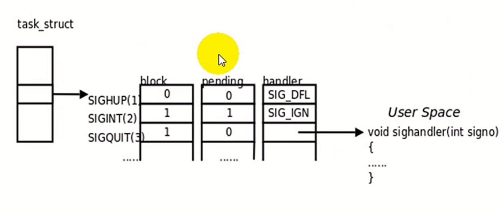

# 信号（一）

## 中断

中断是系统对于异步事件的响应

### 中断分类
- 硬件中断(外部中断)：外部中断是指由外部设备通过硬件请求的方式产生的中断，也称为硬件中断
- 软件中断（内部中断)：内部中断是由CPU运行程序错误或执行内部程序调用引起的一种中断，也称为软件中断。

## 信号
- 信号是UNIX系统响应某些状况而产生的事件，进程在接收到信号时会采取相应的行动。
- 信号是因为某些错误条件而产生的，比如内存段冲突、浮点处理器错误或者非法指令等。
- 信号是在软件层次上对中断的一种模拟，所以通常把它称为是软中断。
- kill -l命令查看信号名称，man 7 signal查看详细手册
- 信号的名称是在头文件signal.h里定义的
### 常用的信号
信号名称|描述
-|-
SIGABRT|进程停止运行
SIGALRM|警告钟
SIGFPE|算述运算例外
SIGHUP|系统桂断
SIGILL|非法指令
SIGINT|终端中断
SIGKI LL|停止进程（此信号不能被忽略或捕获)
SIGPIPE|向没有读者的管道写入数据
SIGSEGV|无效内存段访问


## 信号与中断

### 信号与中断的相似点:
- 采用了相同的异步通信方式;
- 当检测出有信号或中断请求时，都暂停正在执行的程序而转去执行相应的处理程序;
- 都在处理完毕后返回到原来的断点;
- 对信号或中断都可进行屏蔽。
### 信号与中断的区别:
- 中断有优先级，而信号没有优先级，所有的信号都是平等的;
- 信号处理程序是在用户态下运行的，而中断处理程序是在核心态下运行;
- 中断响应是及时的，而信号响应通常都有较大的时间延迟

## 进程对信号的反应

- 忽略信号
  - 不采取任何操作、有两个信号不能被忽略:SIGKILL和SIGSTOP。
- 捕获并处理信号
  - 内核中断正在执行的代码，转去执行先前注册过的处
- 执行默认操作
  - 默认操作通常是终止进程，这取决于被发送的信号。


## signal
功能：给程序安装一个信号处理程序
```
typedef void (*_sighandler_t)(int);
#define SlG_ERR((_sighandler_t) -1)
#define SlG_DFL ((__sighandler_t )0)
#define slG_IGN((__sighandler_t)1)
```
- 函数原型:
  - _sighandler_t signal(int signum,__sighandler_t handler);
- 参数
  - signal是一个带signum和handler两个参数的函数，准备捕捉或屏蔽的信号由参数signum给出，接收到指定信号时将要调用的函数由handler给出
  - handler这个函数必须有一个int类型的参数（即接收到的信号代码)，它本身的类型是void
  - handler也可以是下面两个特殊值:SIG_IGN 屏蔽该信号; SIG_DFL恢复默认行为

# 信号（二）

## 信号分类
- 可靠信号
- 不可靠信号
- 实时信号
- 非实时信号

## 不可靠信号
linux信号机制基本上是从unix系统中继承过来的。早期unix系统中的信号机制比较简单和原始，后来在实践中暴露出一些问题，它的主要问题是:
- 进程每次处理信号后，就将对信号的响应设置为默认动作。在某些情况下，将导致对信号的错误处理;因此，用户如果不希望这样的操作，那么就要在信号处理函数结尾再一次调用signal()，重新安装该信号。
- 早期unix下的不可靠信号主要指的是进程可能对信号做出错误的反应以及信号可能丢失。
- linux支持不可靠信号，但是对不可靠信号机制做了改进:在调用完信号处理函数后，不必重新调用该信号的安装函数（信号安装函数是在可靠机制上的实现)。因此，linux下的不可靠信号问题主要指的是信号可能丢失。
- 从SIGHUP ~ SIGSYS均为不可靠信号

## 可靠信号（又称实时信号）
- 随着时间的发展，实践证明了有必要对信号的原始机制加以改进和扩充。所以，后来出现的各种uni版本分别在这方面进行了研究，力图实现"可靠信号"。由于原来定义的信号已有许多应用，不好再做改动，最终只好又新增加了一些信号，并在一开始就把它们定义为可靠信号，这些信号支持排队，不会丢失。
- 同时，信号的发送和安装也出现了新版本:信号发送函数sigqueue()及信号安装函数sigaction()。
- 从SIGMIN ~ SIGMAX均为可靠信号，又称实时信号
- 早期Unix系统只定义了32种信号，Ret hat7.2支持64种信号，编号0-63(SIGRTMIN=31， SIGRTMAX=63)， 将来可能进一步增加，这需要得到内核的支持。前32种信号已经有了预定义值，每个信号有了确定的用途及含义，并且每种信号都有各自的缺省动作。如按键盘的CTRL ^C时，会产SIGINT信号，对该信号的默认反应就是进程终止。后32个信号表示实时信号，等同于前面阐述的可靠信号。这保证了发送的多个实时信号都被接收。实时信号是POSIX标准的一-部分，可用于应用进程。
- 非实时信号都不支持排队，都是不可靠信号;实时信号都支持排队，都是可靠信号。

## 信号发送
- kill
- raise 
  - 给自己发送信号。raise(sig)等价于kill (getpid(), sig);
- killpg
  - 给进程组发送信号。killpg (pgrp，sig) 等价于kill(-PgIP, sig);
- sigqueue
  - 给进程发送信号，支持排队，可以附带信息。


## pause
- 将进程置为可中断睡眠状态。然后它调用schedule()， 使linux进程调度器找到另一个进程来运行。
- pause使调用者进程挂起，直到一个信号被捕获


# 信号（三）

## 更多信号发送函数

### alarm
- 功能：发送SIGALRM（时钟）信号

### setitimer
- 功能：发送SIGALRM SIGVTALRM SIGPROF信号

### abort
- 功能：发送SIGABRT信号

## 可重入函数与不可重入函数
- 为了增强程序的稳定性，在信号处理函数中应使用可重入
函数。

- 所谓**可重入函数**是指一个可以被多个任务调用的过程，任
务在调用时不必担心数据是否会出错。因为进程在收到信
号后，就将跳转到信号处理函数去接着执行。如果信号处
理函数中使用了不可重入函数，那么信号处理函数可能会
修改原来进程中不应该被修改的数据，这样进程从信号处
理函数中返回接着执行时，可能会出现不可预料的后果。
不可再入函数在信号处理函数中被视为不安全函数。

- 满足下列条件的函数多数是不可再入的: (1) 使用静态
的数据结构，如getlogin(); gmtime()， getgrgid()，
getgrnam()，getpwuid()以 及getpwnam()等等; (2) 函
数实现时，调用了malloc ( )或者free()函数; (3) 实现
时使用了标准I/O函数的

## 不可重入函数示例
[05reentrant.c](05reentrant.c)

# 信号（四）

## 信号在内核中的表示
执行信号的处理动作称为信号**递达**(Delivery)，
信号从产生到递达之间的状态，称为信号**未决**(Pending)。
进程可以选择阻塞(Block)某个信
号。被阻塞的信号产生时将保持在未决状态，直
到进程解除对此信号的阻塞，才执行递达的动作
注意，阻塞和忽略是不同的，只要信号被阻塞.
就不会递达，而忽略是在递达之后可选的一-种处
理动作。信号在内核中的表示可以看作是这样的：

- block：信号屏蔽字（64位），信号对应的位=1，则信号到来时会阻塞
- pending：信号未决字
- handler：处理函数列表

## 信号集操作函数
```
#include <signal.h>
int sigemptyset(sigset_ _t *set); // 信号全部集置0
int sigfillset(sigset_ _t *set);  // 信号全部集置1
int sigaddset(sigset_ _t *set, int signo); // 将signo加到信号集中
int sigdelset(sigset_ _t *set, int signo); // 将signo从信号集中删除
int sigismember(const sigset_ t *set, int signo); // 判断signo是否在信号集中
```

## sigprocmask
- 原型：
```
#include <signal.h>
int sigprocmask(int how, const sigset_ t *set, sigset_t *oset);
```
- 功能:读取或更改进程的信号屏蔽字。
- 返回值:若成功则为0, 若出错则为-1
- 如果oset是非空指针，则读取进程的当前信号屏蔽字通过
oset参数传出。如果set是非空指针，则更改进程的信号屏
蔽字，参数how指示如何更改。如果oset和set都是非空指
针，则先将原来的信号屏蔽字备份到oset里，然后根据set
和how参数更改信号屏蔽字。假设当前的信号屏蔽字为
mask，下 表说明了how参数的可选值。

value|功能
-|-
SIG_BLOCK|set包含了我们希望添加到当前信号屏蔽字的信号，相当于mask=mask|set
SIG_UNBLOCK|set包含了我们希望从当前信号屏蔽字中解除阻塞的信号，相当于mask=rmask&~set
SIG SETMASK|设置当前信号屏蔽字为set所指向的值，相当于mask=set


# 信号（五）
## sigaction函数
- 功能:sigaction函数用于改变进程接收到特定信号后的行为
- 原型:
  - int sigaction(int signum, const struct sigaction *act, const struct sigaction *old);
- 参数
  - 该函数的第一个参数为信号的值，可以为除SIGKILL及SIGSTOP外的任何一个特定有效的信号(为这两个信号定义自己的处理函数，将导致信号安装错误)
  - 第二个参数是指向结构sigaction的一个实例的指针，在结构sigaction的实例中，指定了对特定信号的处理，可以为空，进程会以缺省方式对信号处理
  - 第三个参数oldact指向的对象用来保存原来对相应信号的处理，可指定oldact为NULL。
- 返回值:函数成功返回0，失败返回-1

## sigaction结构体
第二个参数sigaction最为重要，其中包含了对指定信号的
处理、信号所传递的信息、信号处理函数执行过
程中应屏蔽掉哪些函数等等。
```
struct sigaction {
    void     (*sa_handler)(int); // 根据新老信号的不同sa_handler,sa_sigaction二选一
    void     (*sa_sigaction)(int, siginfo_t *, void *);
    sigset_t   sa_mask; // 信号屏蔽字
    int        sa_flags; // 改变信号的行为，具体看man
    void     (*sa_restorer)(void); // 不使用
};
```

## sigaction示例
[07sigaction](07sigaction.c)
[08sigmask](08sigmask.c)

# 信号（六）

## sigqueue函数
- 功能:新的发送信号系统调用，主要是针对实时信号提出的支持信号带有参数,与函数sigaction()配合使用。
- 原型:
  - int sigqueue(pid_ _t pid, int sig, const unionsigval value);
- 参数
  - sigqueue的第一个参数是指定接收信号的进程id,第二个参数确定即将发送的信号，第三个参数是一个联合数据结构union sigval指定了信号传递的参数，即通常所说的4字节值。
- 返回值：成功返回0,失败返回-1
- sigqueue()比kill()传递了更多的附加信息，但sigqueue()只能向一个进程发送信号，而不能发送信号给一个进程组。
```
union sigval {
    int   sival_int;
    void *sival_ptr;
};
```

## sigval联合体


## sigqueue示例.
